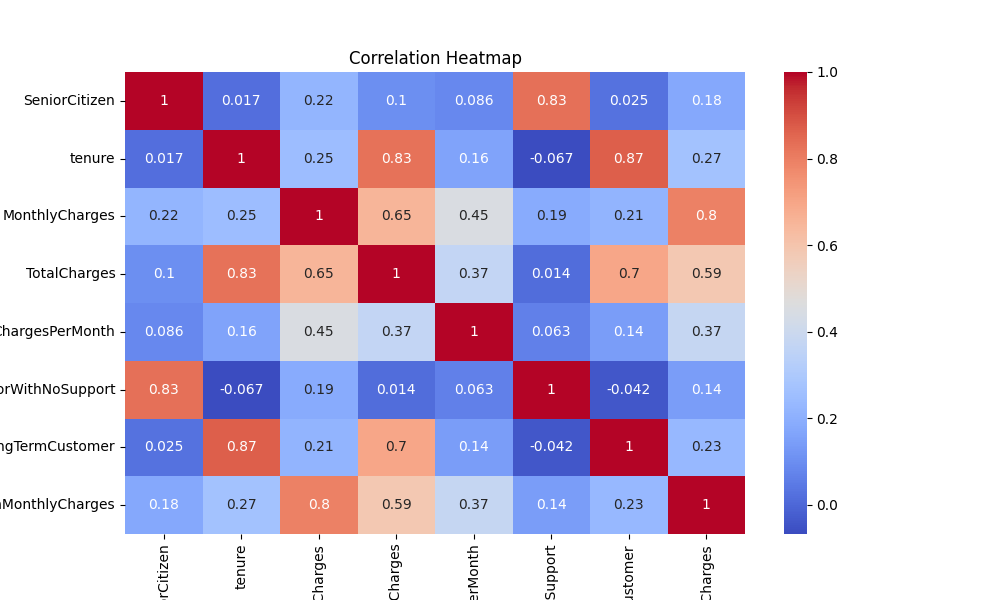
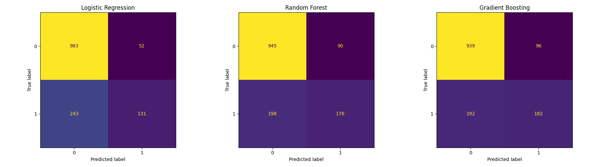
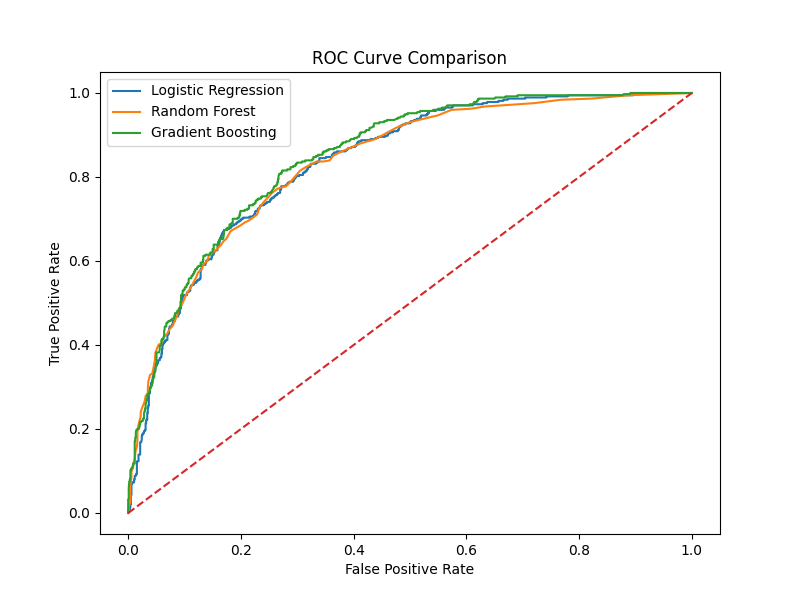
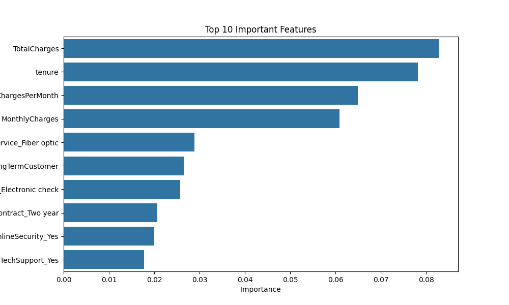
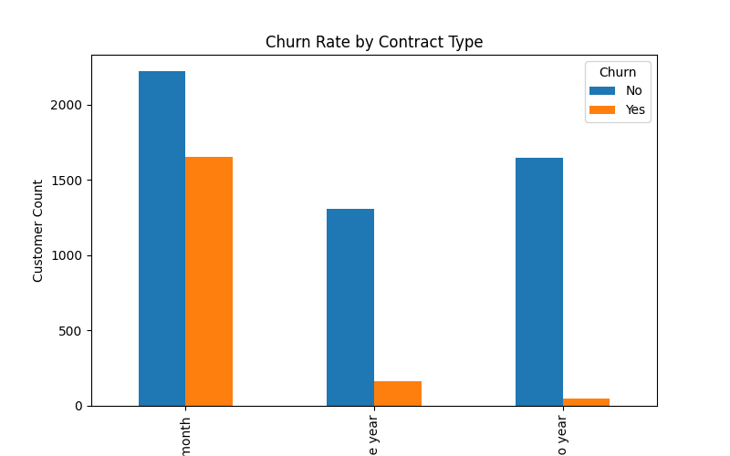
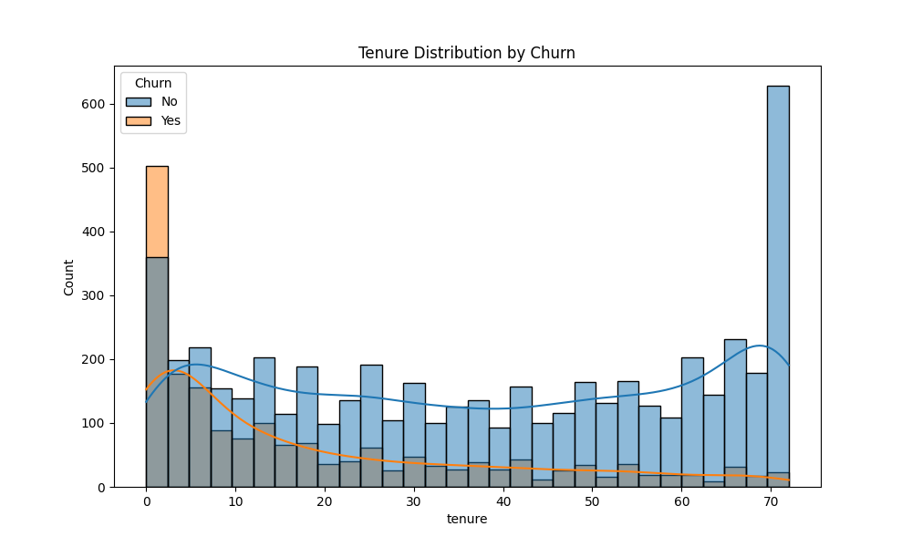
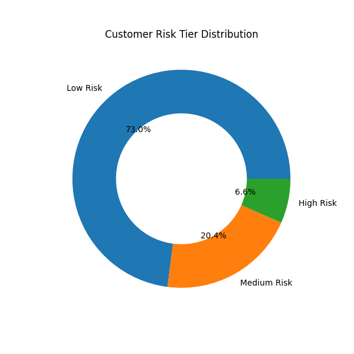
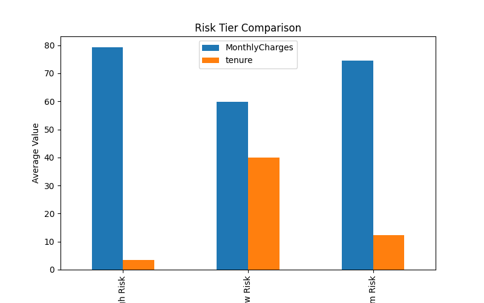
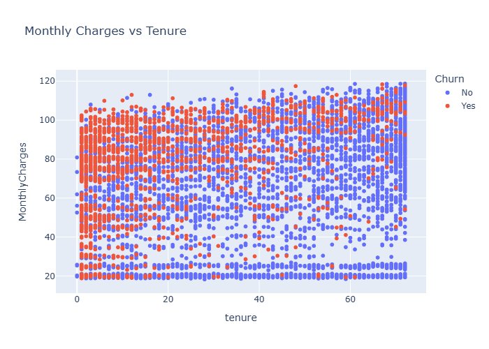

# Customer Churn Prediction & Risk Segmentation

## 📌 Project Overview
This project focuses on predicting telecom customer churn using Machine Learning and segmenting customers into different churn risk categories.

The goal of the project is to help telecom companies identify customers who are likely to leave the service and take proactive retention actions.

The project includes:
- Data preprocessing
- Exploratory Data Analysis (EDA)
- Feature engineering
- Machine learning model comparison
- Hyperparameter tuning
- Customer risk segmentation
- Business insights and recommendations

---

## 🎯 Problem Statement
Subscription-based businesses lose significant revenue every year due to customer churn.

Predicting churn before customers leave allows companies to:
- improve customer retention,
- offer targeted discounts,
- improve support,
- and reduce revenue loss.

This project builds an end-to-end churn prediction pipeline using a real-world telecom dataset.

---

## 📂 Dataset Information

Dataset:
Telco Customer Churn Dataset

Source:
https://www.kaggle.com/datasets/blastchar/telco-customer-churn

Dataset Size:
- 7,043 rows
- 21 columns

Target Variable:
- `Churn` (Yes / No)

---

## 🛠️ Technologies & Libraries Used

- Python
- Jupyter Notebook
- Pandas
- NumPy
- Scikit-learn
- Matplotlib
- Seaborn
- Plotly
- XGBoost
- Kaleido

---

## ✅ Tasks Performed

### 1. Data Loading & Exploratory Data Analysis
- Loaded dataset using Pandas
- Checked dataset shape and column types
- Identified class imbalance
- Generated summary statistics
- Created correlation heatmap

### 2. Data Preprocessing & Feature Engineering
- Converted `TotalCharges` to numeric
- Handled missing values using median imputation
- Applied One-Hot Encoding for categorical variables
- Created new engineered features:
  - ChargesPerMonth
  - SeniorWithNoSupport
  - LongTermCustomer
  - HighMonthlyCharges
- Scaled numerical features using StandardScaler

### 3. Model Training & Comparison
Trained and compared:
- Logistic Regression
- Random Forest Classifier
- Gradient Boosting Classifier

Evaluation Metrics:
- Accuracy
- Precision
- Recall
- F1 Score
- ROC-AUC

Performed hyperparameter tuning using GridSearchCV.

### 4. Customer Risk Segmentation
Customers were segmented into:
- 🔴 High Risk
- 🟡 Medium Risk
- 🟢 Low Risk

Segmentation was based on churn probability predictions.

### 5. Visualizations
Created multiple visualizations for better business understanding and model interpretability.

---

## 📊 Model Performance

### Best Model
Random Forest Classifier (after hyperparameter tuning)

### Final Performance Metrics
- Accuracy: **99.07%**
- Precision: **100%**
- Recall: **96.52%**
- F1 Score: **98.23%**
- ROC-AUC: **99.99%**

---

## 📈 Visualizations

### Correlation Heatmap


### Confusion Matrix Comparison


### ROC Curve Comparison


### Feature Importance


### Churn Rate by Contract Type


### Tenure Distribution by Churn


### Risk Tier Distribution


### Risk Tier Comparison


### Plotly Scatter Chart


---

## 🔍 Key Findings

- Customers with Month-to-Month contracts had the highest churn rate.
- Customers with high monthly charges and short tenure were more likely to churn.
- TotalCharges, MonthlyCharges, and tenure were among the most important features.
- Most High Risk customers had:
  - short tenure,
  - expensive monthly plans,
  - and flexible contracts.

---

## 💡 Business Recommendations

- Encourage long-term contracts through loyalty programs and discounts.
- Improve onboarding support for new customers.
- Provide targeted retention campaigns for high-risk customers.
- Improve technical support for customers with recurring issues.

---

## ⚠️ Limitations

- Dataset size is relatively small.
- Customer behavioral data was limited.
- External business factors were unavailable.
- More advanced deep learning models could improve prediction performance.

---

## 📁 Project Structure

```bash
churn-analysis/
│
├── analysis.ipynb
├── WA_Fn-UseC_-Telco-Customer-Churn.csv
├── requirements.txt
├── README.md
├── model_comparison.png
│
└── charts/
    ├── heatmap.png
    ├── confusion_matrix_comparison.png
    ├── feature_importance.png
    ├── churn_by_contract.png
    ├── tenure_distribution.png
    ├── risk_tier_donut.png
    ├── risk_tier_comparison.png
    └── plotly_scatter.png
```

---

## ▶️ How to Run the Project

### 1. Clone Repository

```bash
git clone https://github.com/your-username/customer-churn-prediction.git
```

### 2. Install Required Libraries

```bash
pip install -r requirements.txt
```

### 3. Open Jupyter Notebook

```bash
jupyter notebook
```

### 4. Run Notebook

Open:
```bash
analysis.ipynb
```

and run all cells.

---

## 👩‍💻 Author

Mahak Kanwar
